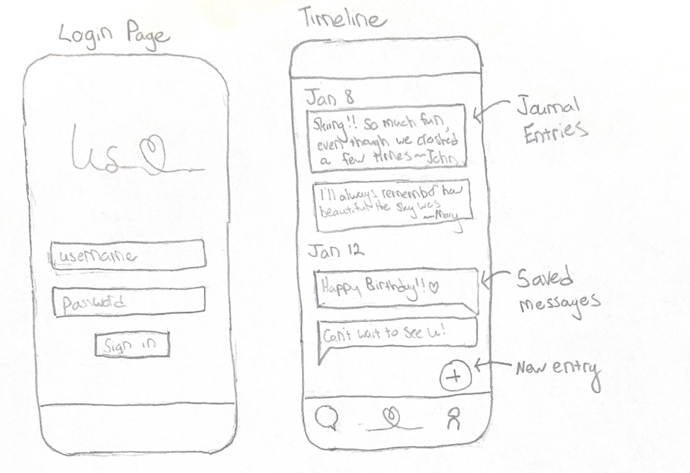
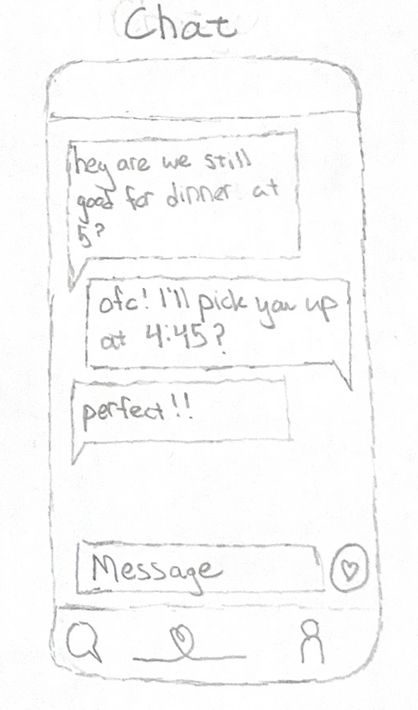

# Us

[My Notes](notes.md)

This application will provide direct messaging exclusively between the user and one other person. Embedded within the chat will be the ability to save messages to a shared timeline. Within the timeline you will also be able to upload custom entries that serve to keep a record of fun memories and key events in your relationship. The goal is to create a messaging application designed for use between you and your partner and make it easy to document memories and moments so that they are saved for years to come. 

## 🚀 Specification Deliverable

For this deliverable I did the following. I checked the box `[x]` and added a description for things I completed.

- [x] Proper use of Markdown
- [x] A concise and compelling elevator pitch
- [x] Description of key features
- [x] Description of how you will use each technology
- [x] One or more rough sketches of your application. Images must be embedded in this file using Markdown image references.

### Elevator pitch

 The substance of life is connecting with people. With so much of our connection happening online on an increasing number of platforms it's easy for those moments of connection to get lost in the shuffle, or stuck behind ten minutes of scrolling to find that one message. _Us_ redefines that experience with the most important person in your life. _Us_ provides the perfect place to connect with your special someone, away from the jumble of messages and notifications in other apps to focus only on them. When you get a message that melts your heart or makes your laugh out loud, quickly save it to the built-in timeline, along with your favorite memories and moments so that you can always remember the things that made you and them, _Us_.

### Design

### Key features

- Secure login over HTTPS
- Link profiles with partner
- Instant message with partner
- Shared timeline with ability to add messages from the chat and longer custom entries
- Persisent storage of messages and timeline and functionality to scroll through both
- Account page with user info and options/settings

### Technologies

I am going to use the required technologies in the following ways.

- **HTML** - Used to structure the application. Four HTML pages including a sign-in, chat, timeline, and account page
- **CSS** - Used for application styling that looks clean and simple on various screen sizes. Thoughtful spacing and sizing of elements with a unified color scheme
- **React** - Used for login, switching between pages, displaying chats, handling scrolling, making components, and calling backend services to send and load messages
- **Service** - Backend service with the following endpoints:
    - login authentication
    - account linking
    - sending messages
    - loading message history
    - updating timeline
    - loading timeline
    - pull from BoredAPI to generate ideas to do together
- **DB/Login** - Store users, messages, and timeline in database with their associated metadata. Store account credentials as well as which users are linked, only allowing for each user to be linked to one other user.
- **WebSocket** - Delivering messages to recipient and posting updates to the timeline

## 🚀 AWS deliverable

For this deliverable I did the following. I checked the box `[x]` and added a description for things I completed.

- [x] **Server deployed and accessible with custom domain name** - [My server link](https://justusapp.click).

## 🚀 HTML deliverable

For this deliverable I did the following. I checked the box `[x]` and added a description for things I completed.

- [x] **HTML pages** - Made 4 HTML pages
- [x] **Proper HTML element usage** - Used correct semantic structure in each page
- [x] **Links** - Made links between all of the pages
- [x] **Text** - Added filler text for places where text from the database will come
- [x] **3rd party API placeholder** - Made a placeholder button for the bored API call on the profile page
- [x] **Images** - Added in an app logo on the main and profile pages
- [x] **Login placeholder** - On the main page made a spot to sign in as well as create an account
- [x] **DB data placeholder** - Database will display timeline as well as messages
- [x] **WebSocket placeholder** - Websockets will be used for messages and updating timeline

## 🚀 CSS deliverable

For this deliverable I did the following. I checked the box `[x]` and added a description for things I completed.

- [x] **Visually appealing colors and layout. No overflowing elements.** - Unified theme and gradient log-in page
- [x] **Use of a CSS framework** - Used boostrap elements for nav-bars, input fields, and buttons
- [x] **All visual elements styled using CSS** - Everything is visually styled
- [x] **Responsive to window resizing using flexbox and/or grid display** - Used flexbox for all the layouts
- [x] **Use of a imported font** - Imported `Lora` font from google fonts and used as an accent font
- [x] **Use of different types of selectors including element, class, ID, and pseudo selectors** - Used class selectors, id selectors, element selectors, and had combinations of them
      for various rules

## 🚀 React part 1: Routing deliverable

For this deliverable I did the following. I checked the box `[x]` and added a description for things I completed.

- [x] **Bundled using Vite** - Installed vite and used it as my front end tool
- [x] **Components** - Converted all my pagaes to components
- [x] **Router** - Routed all pages correctly

## 🚀 React part 2: Reactivity deliverable

For this deliverable I did the following. I checked the box `[x]` and added a description for things I completed.

- [x] **All functionality implemented or mocked out** - Implemented log in and log out as well as sending messages and posting posts on the timeline. I simulated receiving a message using `setInterval` put it in a `useEffect` hook. I also added functionality to select a user to link your profile with for chat and timeline. User info is stored in localStorage.
- [x] **Hooks** - I used multiple hooks including many instances of `useState` as well as `setInterval` and `useEffect` for the chat section.

## 🚀 Service deliverable

For this deliverable I did the following. I checked the box `[x]` and added a description for things I completed.

- [X] **Node.js/Express HTTP service** - Configure app with these packages
- [X] **Static middleware for frontend** - Used the JSON middleware as well as middleware to provide authentication and serve the frontend files
- [X] **Calls to third party endpoints** - Unfortuneately boredAPI wasn't responding well to my requests so I threw in a call to JokeAPI on the profile page
- [X] **Backend service endpoints** - Made endpoints for creating users, logging in, editing users, sending and loading messages as well as posts.
- [X] **Frontend calls service endpoints** - Added calls to those backend endpoints in my login, chat, timeline, and profile pages. Also added functionality to save messages to the timeline
- [X] **Supports registration, login, logout, and restricted endpoint** - Uses cookies and unique ids to support registration, login, and logout. Use those cookies for restricted endpoints throughout the app. Also supports `bcrypt` hashing for passwords.

## 🚀 DB deliverable

For this deliverable I did the following. I checked the box `[x]` and added a description for things I completed.

- [X] **Stores data in MongoDB** - Stores and retrieves messages and posts from MongoDB
- [X] **Stores credentials in MongoDB** - Stores credentials with cookies in MongoDB and uses it for authentication

## 🚀 WebSocket deliverable

For this deliverable I did the following. I checked the box `[x]` and added a description for things I completed.

- [ ] **Backend listens for WebSocket connection** - I did not complete this part of the deliverable.
- [ ] **Frontend makes WebSocket connection** - I did not complete this part of the deliverable.
- [ ] **Data sent over WebSocket connection** - I did not complete this part of the deliverable.
- [ ] **WebSocket data displayed** - I did not complete this part of the deliverable.
- [ ] **Application is fully functional** - I did not complete this part of the deliverable.
